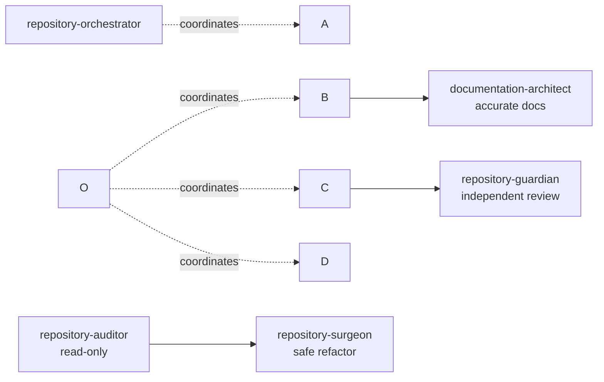

# Repository Excellence Suite

A coordinated, four-stage skill
pipeline that turns a messy, AI-generated, or poorly maintained
repository into a production-grade one — while preserving every bit of
existing functionality. Audit, refactor, document, and independently
review, all from one command.

## Project Overview

Most "clean up this repo" requests collapse audit, refactor,
documentation, and review into a single undifferentiated pass — which
is exactly how an AI assistant ends up quietly fixing things it only
*thinks* are broken, or documenting behavior the code doesn't actually
have. Repository Excellence Suite keeps those four kinds of work
strictly separate, each with its own skill, its own forbidden/allowed
list, and its own quality gate, so that by the time a change reaches
your codebase it's backed by evidence, and by the time something gets
called "done" it's been independently re-verified rather than just
self-reported.

## Features

* **Read-only auditing** — full architecture, dead code, duplication,
complexity, naming, structure, type safety, and dependency analysis,
with zero risk of unintended changes.
* **Evidence-only refactoring** — every change traces back to a
specific audit finding, is verified against your build and test
suite immediately, and has a recorded rollback method.
* **Accurate, grounded documentation** — describes the repository as
it actually behaves post-refactor, not as its names suggest.
* **Independent final review** — a guardian stage that re-verifies
everything from scratch before issuing approval, rather than
rubber-stamping the earlier stages' self-reports.
* **One entry point** — `repository-orchestrator` runs the whole
pipeline, tracks progress in `WORKFLOW\_STATE.md`, and can be safely
paused and resumed.
* **Use any stage standalone** — want just a read-only audit? Invoke
`repository-auditor` directly without touching the rest.

## Included Skills

|Skill|Role|
|-|-|
|[`repository-auditor`](skills/repository-auditor/)|Stage 1 — read-only investigation, 9 reports + scorecard|
|[`repository-surgeon`](skills/repository-surgeon/)|Stage 2 — safe, evidence-based refactoring|
|[`documentation-architect`](skills/documentation-architect/)|Stage 3 — comprehensive, grounded documentation|
|[`repository-guardian`](skills/repository-guardian/)|Stage 4 — independent final review and approval|
|[`repository-orchestrator`](skills/repository-orchestrator/)|Entry point — runs and coordinates all four stages|

## Pipeline Diagram



More diagrams — artifact flow, quality gate flow, and the full
repository lifecycle — are in [`docs/architecture.md`](docs/architecture.md).

## Installation

```bash
git clone https://github.com/<your-org>/repository-excellence-suite.git
cd repository-excellence-suite

mkdir -p \~/.claude/skills
cp -r skills/repository-auditor skills/repository-surgeon \\
      skills/documentation-architect skills/repository-guardian \\
      skills/repository-orchestrator \~/.claude/skills/
```

Full instructions, including project-local installs and
troubleshooting: [`docs/installation.md`](docs/installation.md).

## Quick Start

1. Install the suite (above).
2. In Claude Code, inside the repository you want to improve, say:

> Run Repository Excellence Suite on this repository.

3. Review the outputs as each stage completes — `REPOSITORY\_SCORECARD.md`,
`REFACTOR\_SUMMARY.md`, the generated `README.md`, and finally
`FINAL\_APPROVAL.md`.
4. Approve, or push back on anything in `CHANGESET.md` before merging.

Full walkthrough: [`docs/quickstart.md`](docs/quickstart.md).

## Example Usage

```
You:    Run Repository Excellence Suite on this repository.

Claude: Starting the pipeline. Initializing WORKFLOW\_STATE.md...
        Stage 1/4 — repository-auditor: scanning 142 files...
        ✓ 9 reports + REPOSITORY\_SCORECARD.md generated (overall 6.75/10)
        Stage 2/4 — repository-surgeon: applying 14 evidence-backed changes...
        ✓ Build passes, 42/42 tests pass. REFACTOR\_SUMMARY.md generated.
        Stage 3/4 — documentation-architect: documenting post-refactor state...
        ✓ 10 documentation files generated.
        Stage 4/4 — repository-guardian: independently re-verifying...
        ✓ FINAL\_APPROVAL.md: approved (9.0/10)

        Pipeline complete. Start with FINAL\_APPROVAL.md and
        QUALITY\_SCORECARD.md — both are in the repository root.
```

See [`examples/`](examples/) for realistic, full-length sample outputs
from every stage (built around one consistent fictional project so you
can trace a single issue all the way through the pipeline).

## Repository Structure

```
repository-excellence-suite/
├── README.md
├── LICENSE
├── CHANGELOG.md
├── CONTRIBUTING.md
├── ROADMAP.md
│
├── skills/                        ← install these into your Claude Code skills directory
│   ├── repository-auditor/
│   ├── repository-surgeon/
│   ├── documentation-architect/
│   ├── repository-guardian/
│   └── repository-orchestrator/
│       (each: SKILL.md, README.md, workflows/, templates/, checklists/)
│
├── orchestrator/                  ← suite-wide pipeline contracts, shared by all skills
│   ├── pipeline.md
│   ├── artifact\_contracts.md
│   ├── workflow\_state\_template.md
│   └── quality\_gates.md
│
├── docs/                          ← human-facing documentation
│   ├── installation.md
│   ├── quickstart.md
│   ├── pipeline.md
│   ├── architecture.md
│   ├── release\_process.md
│   └── examples/
│
├── examples/                      ← realistic sample outputs per stage
│   ├── sample-audit/
│   ├── sample-refactor/
│   ├── sample-documentation/
│   └── sample-final-review/
│
└── assets/
    ├── diagrams/                  ← Mermaid source files
    └── screenshots/
```

## Contribution Guidelines

Contributions are welcome — see [`CONTRIBUTING.md`](CONTRIBUTING.md)
for how to propose changes, what to update alongside an artifact
contract change, and this project's branching/PR conventions.

## Roadmap

See [`ROADMAP.md`](ROADMAP.md) for planned v1.x work and what's
explicitly out of scope for now.

## License

[MIT](LICENSE)

## Support Information

* **Bugs and feature requests:** open a GitHub Issue. See suggested
labels in [`docs/release\_process.md`](docs/release_process.md).
* **Questions about how a specific skill behaves:** check that skill's
own `README.md` and `workflows/` folder first — most behavioral
questions are answered there in more depth than this top-level
README can cover.
* **Security concerns:** please open an issue marked clearly as a
security report rather than a general bug, so it can be triaged with
appropriate urgency.

