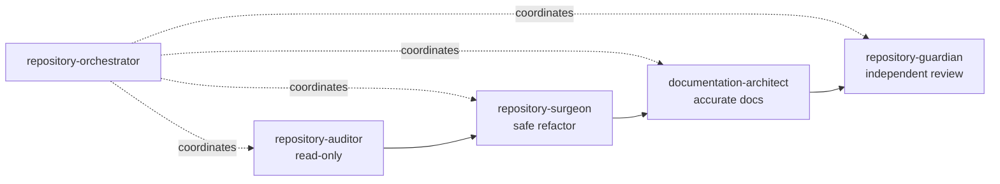
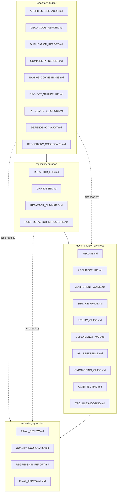
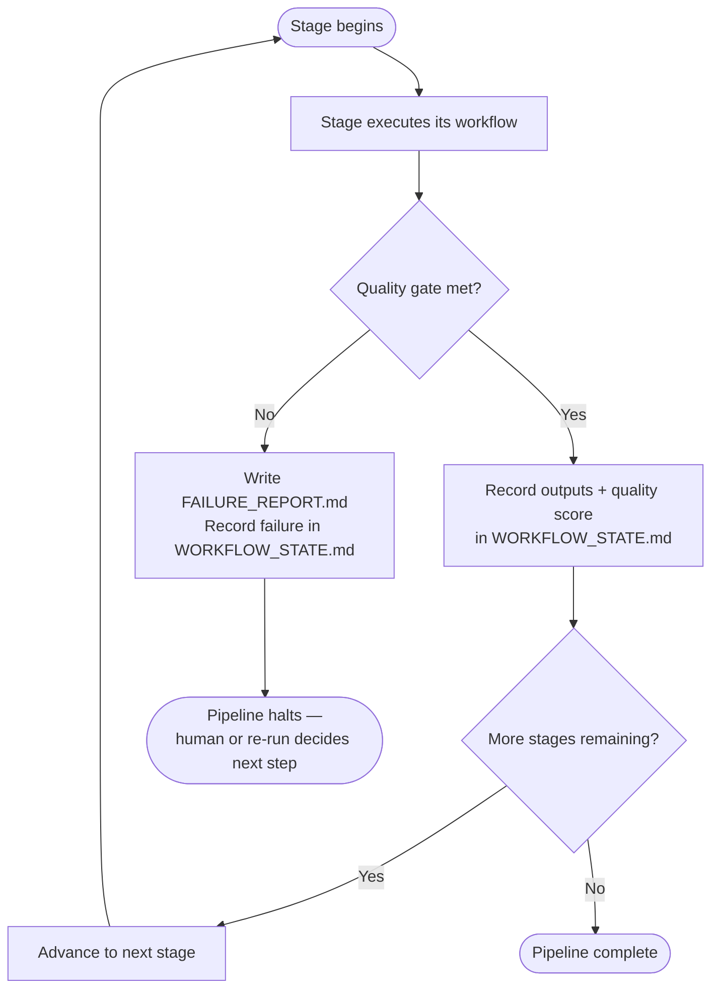
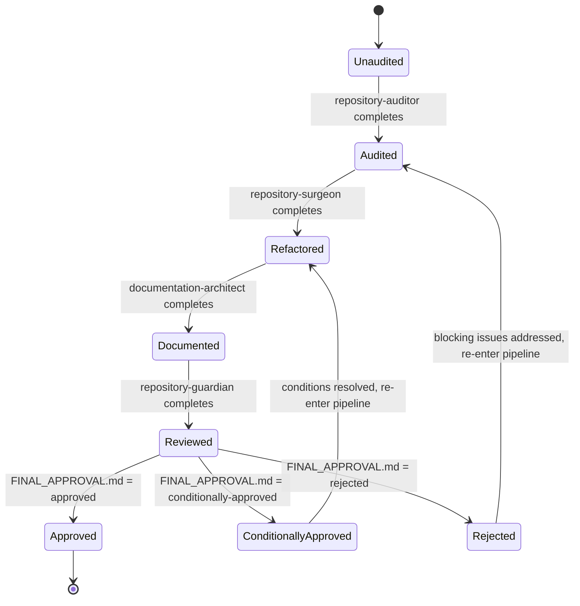

# Architecture

This page contains the four diagrams that describe how Repository
Excellence Suite is put together: the skill pipeline, the artifact
flow between stages, the quality-gate decision flow, and the overall
lifecycle a target repository goes through during a full run.

## Skill Pipeline

The four worker skills run in a fixed order, coordinated by
`repository-orchestrator`.

## Artifact Flow

Each stage's outputs become the next stage's required inputs. Nothing
flows backward, and nothing skips a stage.

## Quality Gate Flow

Every stage is checked against its own gate before the orchestrator
advances the pipeline. A failed gate halts the pipeline rather than
letting a later stage absorb the problem.

## Repository Lifecycle

The state a target repository moves through over the course of one
full pipeline run.

