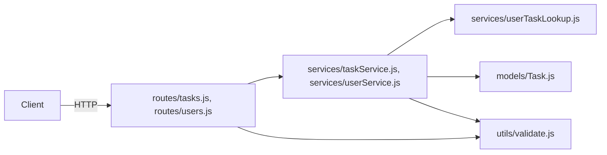

# ARCHITECTURE.md

## Overview

TaskFlow API is a small Express REST API for managing tasks and the
users they're assigned to, backed by a JSON file store. It follows a
layered structure: HTTP routes parse and validate requests, services
hold business logic and persistence, and a small set of shared utils
handle cross-cutting validation.

## Architecture Diagram

## Layers / Modules

| Module | Responsibility | Depends on |
|---|---|---|
| `src/routes/` | Parse requests, call services, format responses | `src/services/`, `src/utils/validate.js` |
| `src/services/` | Business logic, persistence | `src/models/`, `src/utils/validate.js`, `src/services/userTaskLookup.js` |
| `src/services/userTaskLookup.js` | Shared cross-cutting lookups between task and user services | `src/models/` |
| `src/models/` | Data shape definitions | (none) |
| `src/utils/validate.js` | Email and task-title validation | (none) |

## Data Flow

A typical `POST /tasks` request: `routes/tasks.js` parses the body,
calls `validate.isValidTaskTitle()` and `validate.isValidEmail()` from
`utils/validate.js` for the assignee field, then calls
`taskService.createTask()`, which persists the new task via
`models/Task.js` and, if the task has an assignee, calls
`userTaskLookup.incrementAssignedTaskCount()` to keep the user's task
count in sync.

## Key Architectural Decisions

`taskService.js` and `userService.js` previously required each other
directly to support cross-cutting lookups (e.g. looking up a user's
assigned task count from within `userService`). This created a
circular dependency. As of the 2026-03-15 refactor, those lookups live
in a separate `userTaskLookup.js` module that both services depend on,
removing the cycle. See `REFACTOR_SUMMARY.md` for the full history of
that change.

## Dependencies

See `DEPENDENCY_MAP.md` for the full internal and external dependency
graph.
