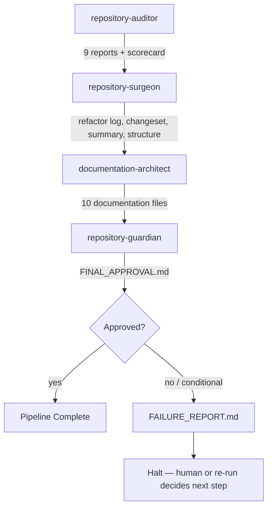

# Pipeline

The Repository Excellence Suite runs four worker skills in a fixed
order, coordinated by `repository-orchestrator`. This document is the
canonical description of that pipeline — inputs, outputs, handoffs,
quality gates, and failure recovery for every stage. Each skill's own
`SKILL.md` and `README.md` link back here rather than repeating it.

## Stage 1 — repository-auditor

- **Inputs:** the repository itself; build/dependency manifest if
  present.
- **Outputs:** `ARCHITECTURE_AUDIT.md`, `DEAD_CODE_REPORT.md`,
  `DUPLICATION_REPORT.md`, `COMPLEXITY_REPORT.md`,
  `NAMING_CONVENTIONS.md`, `PROJECT_STRUCTURE.md`,
  `TYPE_SAFETY_REPORT.md`, `DEPENDENCY_AUDIT.md`,
  `REPOSITORY_SCORECARD.md`.
- **Handoff:** all nine outputs become repository-surgeon's required
  inputs. Nothing in this stage is allowed to modify the repository.
- **Quality gates:** 100% scan coverage, dependency graph generated,
  architecture graph generated, all 9 reports generated.
- **Failure recovery:** if scan coverage can't reach 100% (binary
  files, oversized files, generated code), the gap is noted explicitly
  rather than silently treated as covered. Partial coverage with an
  honest note is acceptable; silent partial coverage is not.

## Stage 2 — repository-surgeon

- **Inputs:** all 9 repository-auditor outputs.
- **Outputs:** `REFACTOR_LOG.md`, `CHANGESET.md`, `REFACTOR_SUMMARY.md`,
  `POST_REFACTOR_STRUCTURE.md`.
- **Handoff:** these four outputs, plus a clean build and passing test
  suite, become documentation-architect's required inputs alongside
  the post-refactor repository itself.
- **Quality gates:** valid imports, no orphaned files, no circular
  references introduced, no duplicated logic introduced, build passes,
  tests pass.
- **Failure recovery:** any single change that breaks the build or
  tests is rolled back immediately using its recorded rollback method
  and logged as failed — it does not block the rest of the stage's
  other, unrelated changes. If an entire refactor category turns out
  too risky given test coverage, that category is skipped and
  documented in `REFACTOR_SUMMARY.md`'s "Deliberately NOT Changed"
  section rather than forced through.

## Stage 3 — documentation-architect

- **Inputs:** the post-refactor repository, all 9 audit reports, all 4
  repository-surgeon outputs.
- **Outputs:** `README.md`, `ARCHITECTURE.md`, `COMPONENT_GUIDE.md`,
  `SERVICE_GUIDE.md`, `UTILITY_GUIDE.md`, `DEPENDENCY_MAP.md`,
  `API_REFERENCE.md`, `ONBOARDING_GUIDE.md`, `CONTRIBUTING.md`,
  `TROUBLESHOOTING.md`.
- **Handoff:** all ten outputs become repository-guardian's required
  inputs alongside the repository itself.
- **Quality gates:** every major folder documented, every service
  documented, every API documented, every utility documented,
  dependency map generated, architecture diagram generated.
- **Failure recovery:** ambiguous behavior is flagged inline (as a
  Common Failure Mode or open question) rather than guessed at. For
  very large repositories, documentation can proceed in priority order
  (highest fan-in modules and public API surface first) with the
  remaining gap explicitly noted.

## Stage 4 — repository-guardian

- **Inputs:** everything from all three previous stages, plus the
  entire repository.
- **Outputs:** `FINAL_REVIEW.md`, `QUALITY_SCORECARD.md`,
  `REGRESSION_REPORT.md`, `FINAL_APPROVAL.md`.
- **Handoff:** `FINAL_APPROVAL.md`'s status is what
  repository-orchestrator checks to decide whether the pipeline is
  complete. Only `approved` counts as complete.
- **Quality gates:** no critical issues, no severe regressions,
  documentation complete, architecture valid, functionality preserved,
  quality score above threshold.
- **Failure recovery:** a critical issue or severe regression results
  in `rejected` or `conditionally-approved` with specific, actionable
  blocking items — never a soft approval that papers over a real
  problem. The recommended next action usually points back at
  repository-surgeon to apply a targeted fix and re-run verification.

## Cross-stage principles

- **No stage may begin without its required artifacts.** This is
  enforced by repository-orchestrator and detailed in
  [`artifact_contracts.md`](./artifact_contracts.md).
- **No stage may skip its own quality gate.** Full criteria in
  [`quality_gates.md`](./quality_gates.md).
- **Every failure halts the pipeline** rather than being silently
  absorbed by a later stage. See
  [`workflow_state_template.md`](./workflow_state_template.md) for how
  failures are tracked.
